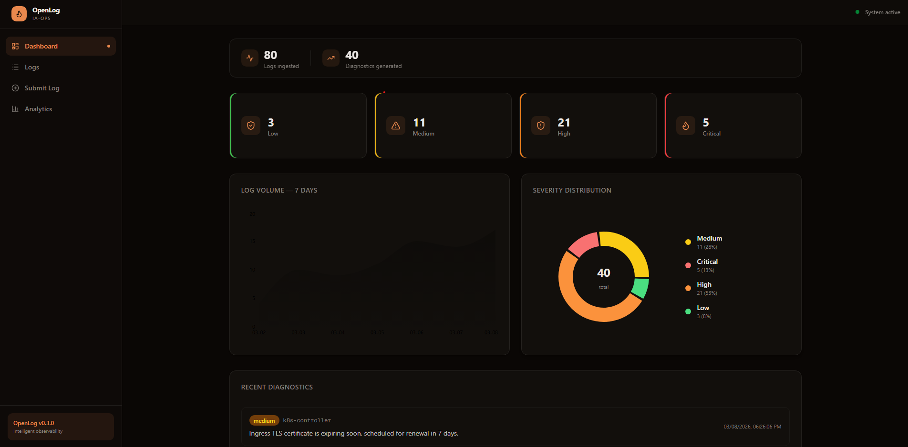
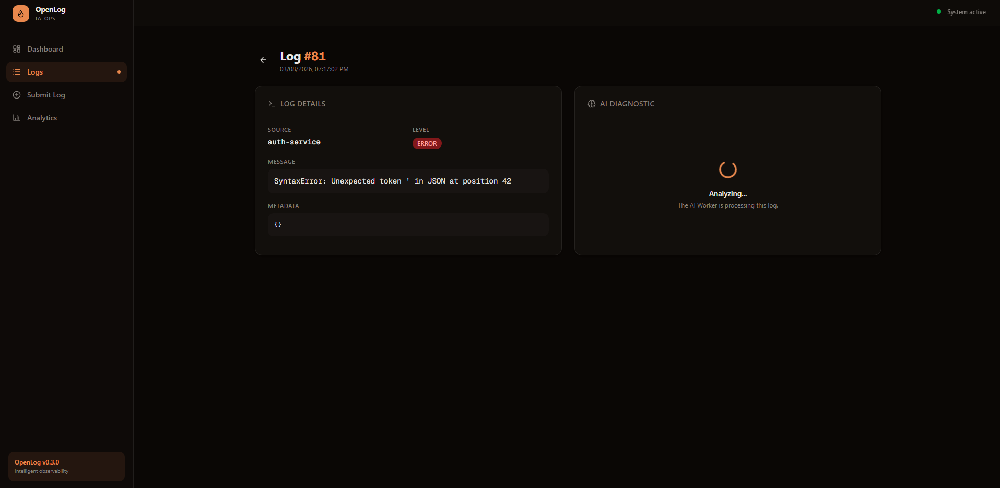
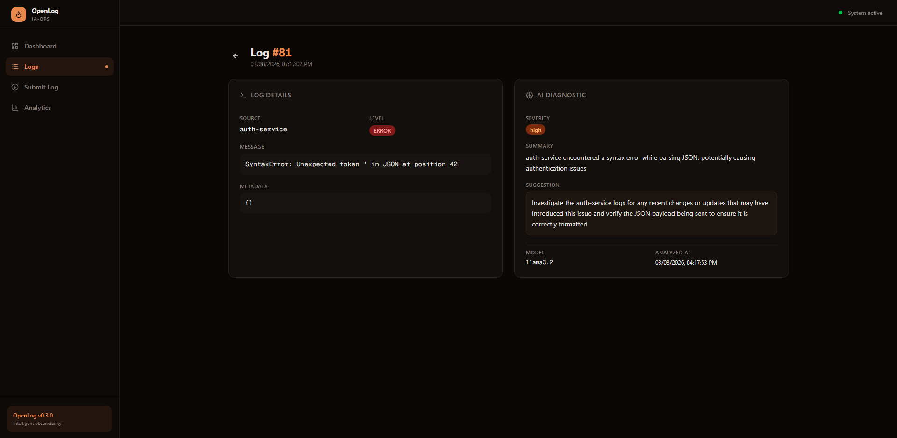

<p align="center">
  <h1 align="center">OpenLog</h1>
  <p align="center">AI-powered observability platform that ingests, analyzes, and diagnoses application logs in real time.</p>
</p>

<p align="center">
  
  
  
  
  
  
  
  
  
  
  
  
</p>

---



## Why OpenLog?

Traditional log management tools show you _what happened_. OpenLog tells you _why it happened_ and _what to do about it_. Every log ingested is automatically analyzed by an AI worker that produces:

- **Severity classification** — low, medium, high, or critical
- **Root cause summary** — a concise explanation of the issue
- **Actionable suggestion** — what steps to take to resolve it

---

## Architecture

```
                    ┌─────────────────────────────────────────────────┐
                    │                   Client / SDK                  │
                    └──────────────────────┬──────────────────────────┘
                                           │ POST /api/v1/logs
                                           ▼
                    ┌──────────────────────────────────────────────────┐
                    │            Ingestion API (Go)                    │
                    │  • Validates & persists log to PostgreSQL        │
                    │  • Publishes message to RabbitMQ queue           │
                    └──────────────┬───────────────┬───────────────────┘
                                   │               │
                            ┌──────▼──────┐  ┌─────▼──────┐
                            │ PostgreSQL  │  │  RabbitMQ   │
                            │  (logs +    │  │  (message   │
                            │ diagnostics)│  │   queue)    │
                            └──────▲──────┘  └─────┬──────┘
                                   │               │ consume
                                   │         ┌─────▼──────────────────┐
                                   │         │    AI Worker (Python)   │
                                   │         │  • Consumes from queue  │
                                   │         │  • Calls LLM (Ollama    │
                                   │         │    or OpenAI)           │
                                   │         │  • Writes diagnostic    │
                                   └─────────┤    back to PostgreSQL   │
                                             └────────────────────────┘

                    ┌──────────────────────────────────────────────────┐
                    │          Dashboard (Next.js / React)             │
                    │  • Reads logs & diagnostics from PostgreSQL      │
                    │  • Real-time polling for pending diagnostics     │
                    │  • Charts, analytics, log detail views           │
                    └──────────────────────────────────────────────────┘
```

### Services

| Service | Language | Port | Responsibility |
|---|---|---|---|
| **Ingestion API** | Go | `8080` | High-performance REST API for log ingestion |
| **AI Worker** | Python | — | Consumes queue, analyzes logs with LLM, writes diagnostics |
| **Dashboard** | TypeScript (Next.js) | `3000` | Real-time observability UI with charts and analytics |
| **PostgreSQL** | — | `5432` | Persistent storage for logs and diagnostics |
| **RabbitMQ** | — | `5672` | Message broker decoupling ingestion from processing |
| **Redis** | — | `6379` | Cache and rate limiting |
| **Ollama** | — | `11434` | Local LLM inference (Llama 3.2) |

---

## Data Flow

```
1. Log Submitted      ──►  Ingestion API receives JSON payload
2. Persisted           ──►  Log saved to PostgreSQL (logs table)
3. Queued              ──►  Message published to RabbitMQ
4. Consumed            ──►  AI Worker picks up message from queue
5. Analyzed            ──►  LLM generates severity, summary, suggestion
6. Diagnostic Saved    ──►  Result written to PostgreSQL (diagnostics table)
7. Dashboard Updates   ──►  Polling detects new diagnostic, UI updates live
```

When a log is submitted, the dashboard shows a real-time loading state while the AI Worker processes it — no manual refresh needed:



Once the AI diagnostic is ready, the result appears automatically with severity, summary, and actionable suggestions:



---

## Getting Started

### Prerequisites

- [Docker](https://docs.docker.com/get-docker/) >= 24.0
- [Docker Compose](https://docs.docker.com/compose/install/) >= 2.20
- [Go](https://go.dev/dl/) >= 1.22 (for local ingestion development)
- [Python](https://www.python.org/downloads/) >= 3.11 (for local AI worker development)

### Quick Start

```bash
# 1. Clone the repository
git clone https://github.com/your-username/openlog.git
cd openlog

# 2. Configure environment variables
cp .env.example .env
# Edit .env with your credentials (OPENAI_API_KEY if using OpenAI)

# 3. Start all services
docker compose up -d

# 4. Open the dashboard
open http://localhost:3000
```

### Sending Your First Log

```bash
curl -X POST http://localhost:8080/api/v1/logs \
  -H "Content-Type: application/json" \
  -d '{
    "source": "api-gateway",
    "level": "ERROR",
    "message": "Connection timeout after 30s waiting for upstream service",
    "metadata": {
      "latency_ms": 30012,
      "upstream": "user-service"
    }
  }'
```

### Seed Data for Demo

```bash
bash scripts/seed-logs.sh
```

Sends 40 realistic log entries across 8 services with various severity levels.

---

## API Reference

### `POST /api/v1/logs`

**Request:**

```json
{
  "source": "string (required)",
  "level": "DEBUG | INFO | WARN | ERROR | FATAL",
  "message": "string (required)",
  "metadata": { }
}
```

**Response:** `201 Created`

```json
{
  "id": 1,
  "message": "Log received"
}
```

---

## Project Structure

```
openlog/
├── services/
│   ├── ingestion/           # Go REST API
│   ├── ai-worker/           # Python LLM worker
│   └── dashboard/           # Next.js frontend
├── migrations/sql/          # SQL migrations (dbmate)
├── scripts/                 # Seed scripts and utilities
├── docs/                    # Technical documentation
├── docker-compose.yml       # Full stack orchestration
├── Makefile                 # Development shortcuts
└── .env.example             # Environment variables template
```

---

## Environment Variables

| Variable | Default | Description |
|---|---|---|
| `POSTGRES_USER` | openlog | PostgreSQL username |
| `POSTGRES_PASSWORD` | openlog_secret | PostgreSQL password |
| `POSTGRES_DB` | openlog | PostgreSQL database name |
| `RABBITMQ_USER` | openlog | RabbitMQ username |
| `RABBITMQ_PASSWORD` | openlog_secret | RabbitMQ password |
| `REDIS_PASSWORD` | openlog_secret | Redis password |
| `LLM_PROVIDER` | ollama | `ollama` or `openai` |
| `LLM_MODEL` | llama3.2 | Model name for the AI worker |
| `OPENAI_API_KEY` | — | Required if using OpenAI provider |

---

## License

MIT
